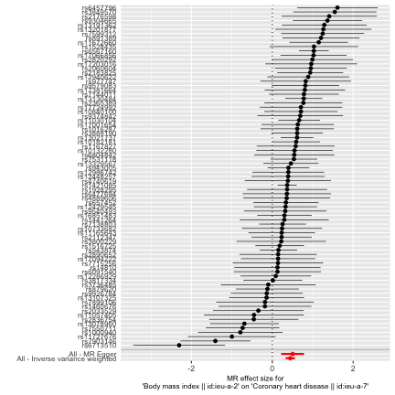
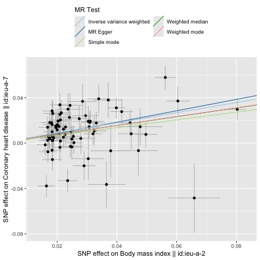
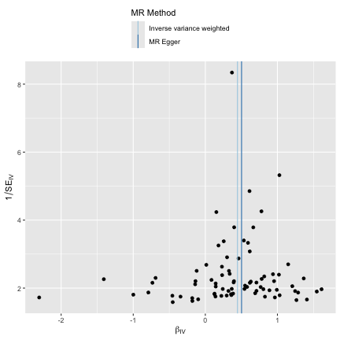
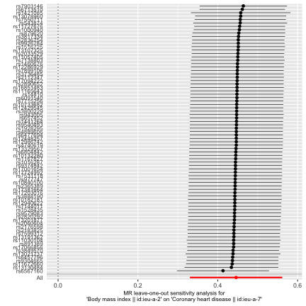

```
## Error: package or namespace load failed for 'Cairo':
##  .onLoad failed in loadNamespace() for 'Cairo', details:
##   call: dyn.load(file, DLLpath = DLLpath, ...)
##   error: unable to load shared object '/Library/Frameworks/R.framework/Versions/4.3-arm64/Resources/library/Cairo/libs/Cairo.so':
##   dlopen(/Library/Frameworks/R.framework/Versions/4.3-arm64/Resources/library/Cairo/libs/Cairo.so, 0x0006): Library not loaded: /opt/X11/lib/libXrender.1.dylib
##   Referenced from: <19DB52CB-3BE5-3260-9C92-D9D6F67FE3EF> /Library/Frameworks/R.framework/Versions/4.3-arm64/Resources/library/Cairo/libs/Cairo.so
##   Reason: tried: '/opt/X11/lib/libXrender.1.dylib' (no such file), '/System/Volumes/Preboot/Cryptexes/OS/opt/X11/lib/libXrender.1.dylib' (no such file), '/opt/X11/lib/libXrender.1.dylib' (no such file), '/Library/Frameworks/R.framework/Resources/lib/libXrender.1.dylib' (no such file), '/Library/Java/JavaVirtualMachines/jdk-11.0.18+10/Contents/Home/lib/server/libXrender.1.dylib' (no such file), '/var/folders/lt/0x7tvwzn7_j_x5f5lm7hd57mg83mzb/T/rstudio-fallback-library-path-1593176679/libXrender.1.dylib' (no such file)
```

# Two sample MR report

---

## Body mass index || id:ieu-a-2 against Coronary heart disease || id:ieu-a-7

Date: **30 August, 2024**

---

### Results from two sample MR:


|method                    | nsnp|         b|        se|      pval|
|:-------------------------|----:|---------:|---------:|---------:|
|MR Egger                  |   79| 0.5024935| 0.1439606| 0.0008013|
|Weighted median           |   79| 0.3870065| 0.0731971| 0.0000001|
|Inverse variance weighted |   79| 0.4459091| 0.0589830| 0.0000000|
|Simple mode               |   79| 0.3401554| 0.1591885| 0.0357478|
|Weighted mode             |   79| 0.3888249| 0.0997549| 0.0002040|

---

### Heterogeneity tests


|method                    |        Q| Q_df|  Q_pval|
|:-------------------------|--------:|----:|-------:|
|MR Egger                  | 143.3046|   77| 6.8e-06|
|Inverse variance weighted | 143.6508|   78| 8.7e-06|

--- 

### Test for directional horizontal pleiotropy


| egger_intercept|       se|      pval|
|---------------:|--------:|---------:|
|      -0.0017193| 0.003986| 0.6674266|

--- 

### Test that the exposure is upstream of the outcome


| snp_r2.exposure| snp_r2.outcome|correct_causal_direction | steiger_pval|
|---------------:|--------------:|:------------------------|------------:|
|       0.0158082|      0.0013505|TRUE                     |            0|

Note - R^2 values are approximate

---

### Forest plot of single SNP MR



---

### Comparison of results using different MR methods



---

### Funnel plot



---

### Leave-one-out sensitivity analysis


